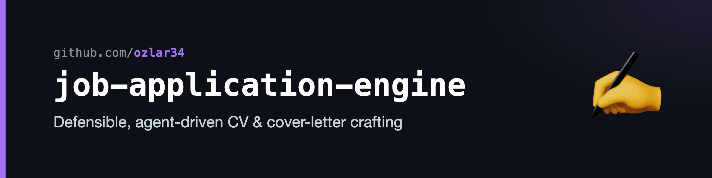
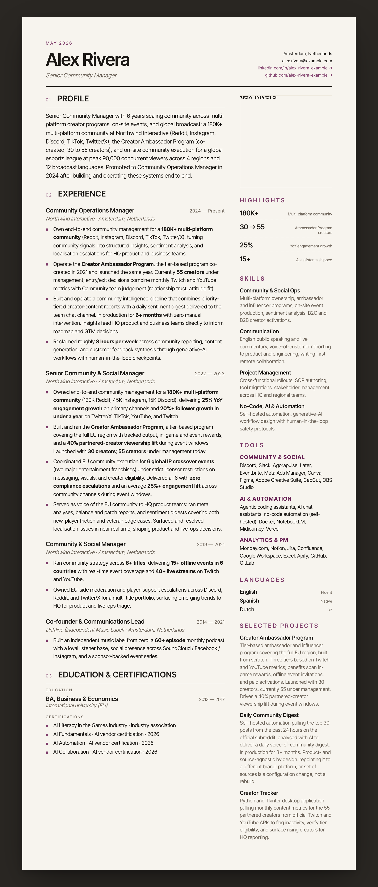

# job-application-engine

> An end-to-end, agent-driven system for **crafting** job applications — tailoring
> CVs and cover letters to a specific job description, gated by defensibility checks,
> with a learnings loop that sharpens the system after every application.

Built as a set of [Claude Code](https://claude.com/claude-code) skills. This repo
showcases the **crafting** half of a larger pipeline; the **sourcing/scoring** half
lives in [job-match-radar](https://github.com/ozlar34/job-match-radar).

> [!NOTE]
> **All data in this repo is synthetic.** The persona (Alex Rivera), companies
> (Lumen AI, Northwind Interactive), and every metric are fictional. The structure
> and engineering are the point — not the facts. See [`templates/README.md`](templates/README.md).

---

## The problem

Tailoring an application by hand is slow, and tailoring it with a naive LLM is worse:
you get fluent prose that quietly invents metrics, drifts from your real history, and
can't survive a follow-up question in the interview. This system treats application
crafting as an **engineering problem** — a fact pool with stable IDs, deterministic
selection rules, and hard gates that block any claim that can't be traced back to
something true.

## The pipeline

```
  ┌─────────┐   ┌────────┐   ┌──────────┐   ┌────────┐   ┌───────┐   ┌───────┐   ┌──────┐
  │  LEAD   │──▶│ SCORE  │──▶│ RESEARCH │──▶│ TAILOR │──▶│ APPLY │──▶│ TRACK │──▶│ PREP │
  └─────────┘   └────────┘   └──────────┘   └────────┘   └───────┘   └───────┘   └──────┘
   watchlist     fit score    company +       CV + cover    submit      log +      story bank
   + digest      + rank       JD capture      letter        materials   outcome    + cheatsheet
   ───────────────────────────              ──────────────────────────────────────────────────
   job-match-radar (separate repo)          this repo  (sourcing/tracking described in docs/)
```

This repo implements the **TAILOR** and **PREP** stages and the JD-capture step that
feeds them. The sourcing/scoring stages (LEAD, SCORE) live in `job-match-radar`; the
tracking stage (APPLY, TRACK) is infrastructure-bound and is **described**, not
reproduced, in [`docs/architecture.md`](docs/architecture.md).

## What makes it defensible

The system's core bet: **every claim must trace to a fact you can defend in the room.**

- **Stable-ID fact pools.** CV bullets and cover-letter blocks live in pools with
  permanent IDs and *locked numbers*. Tailoring *selects and orders* — it never
  invents. Numbers carry a registry so the same metric reads identically everywhere.
- **JD-strand mapping.** A job description is decomposed into strands; each pool item
  is ranked by relevance to those strands, and selection is highest-fit-first — not
  tag-match-then-arbitrary.
- **Hard defensibility gates.** Before any CV or cover letter is emitted, a gate runs:
  trace check (every line ↔ a pool ID), number-registry check, out-of-pool prose scan
  (a sub-agent hunts for invented phrasing), strand-coverage tally, length-fit, and a
  CV↔cover-letter consistency cross-check. A failed gate blocks output.
- **A learnings loop.** Each application appends observations to a learnings log.
  A separate, human-approved promotion pass merges the durable ones back into the
  pools and rules — so the system gets sharper over time without auto-rewriting your
  history.
- **Checkpoint/resume.** Mid-tailoring state snapshots to disk, so a fresh context can
  pick up exactly where it left off.

## The skills

Eight crafting skills, grouped by job:

| Skill | Job |
|---|---|
| **tailor-cv** | Select + order CV bullets for a JD; run the 7-check defensibility gate. |
| **tailor-cover-letter** | Draft a cover letter block-by-block with per-block sign-off and its own gate. |
| **cv-checkpoint** / **cover-letter-checkpoint** | Snapshot mid-tailoring state for fresh-context resume. |
| **cv-promote-learnings** / **cover-letter-promote-learnings** | Merge durable learnings back into pools + rules (human-approved). |
| **build-story-bank** | Maintain a cross-application STAR+R interview story bank. |
| **build-interview-cheatsheet** | Generate a spoken interview cheatsheet from the story bank + CV + research. |

Shared logic lives in [`lib/`](lib/) (folder gates, the promotion engine, atomic-write
discipline, JD capture). Fact pools and render shells live in
[`templates/`](templates/).

## See it work

[`examples/lumen-ai-senior-community/`](examples/lumen-ai-senior-community/) carries a
single fictional JD — *Senior Community Manager @ Lumen AI* — through the full pipeline:
tailored CV (markdown + HTML), tailored cover letter (markdown + HTML), and an interview
cheatsheet. The CV ships with a pick-trace block: every line maps to the pool ID it came
from. PDFs are produced by printing the HTML (`Cmd+P → Margins: None`) and are
intentionally not committed.



> The CV above is the repo's actual HTML output, rendered with the synthetic persona's
> data — the layout and structure are real, the facts are fictional.

## How it's built

- **Claude Code skills** — each skill is a `SKILL.md` (instructions + gates) plus
  `references/` for deep procedures, loaded on demand.
- **Plain markdown as the data layer** — fact pools, rules, and learnings are markdown,
  diffable in git, editable by hand or by the promotion pass.
- **Sub-agents for adversarial checks** — out-of-pool prose detection, AI-tells
  scanning, and CV↔CL consistency run as separate sub-agents so the drafter can't
  grade its own work.
- **Model tiering** — cheap fast models do the bulk critic passes; the main model
  handles selection and the collaborative review.

## Related

- **[job-match-radar](https://github.com/ozlar34/job-match-radar)** — the sourcing +
  scoring half: watchlist, job digest, fit scoring, ranking.

## License

[MIT](LICENSE)
